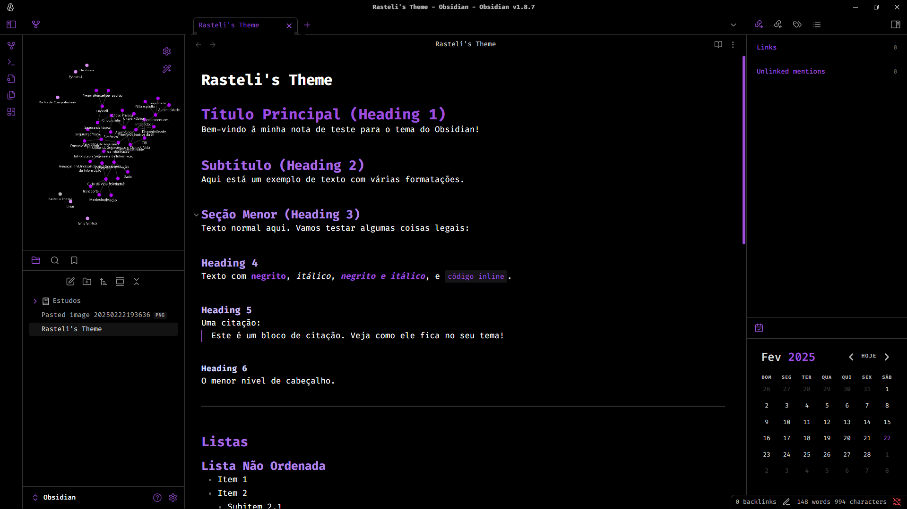

# Rasteli's Theme
Para quem gosta de minimalismo e AMOLED black!

## Instalação
1. Baixe o arquivo `theme.css`.
2. Coloque-o na pasta `.obsidian/themes/` do seu vault.
3. Ative o tema em Configurações > Aparência no Obsidian.

## Captura de Tela
